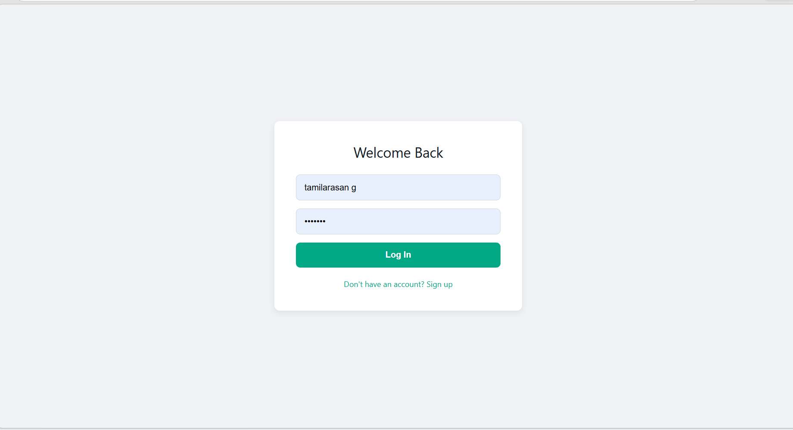
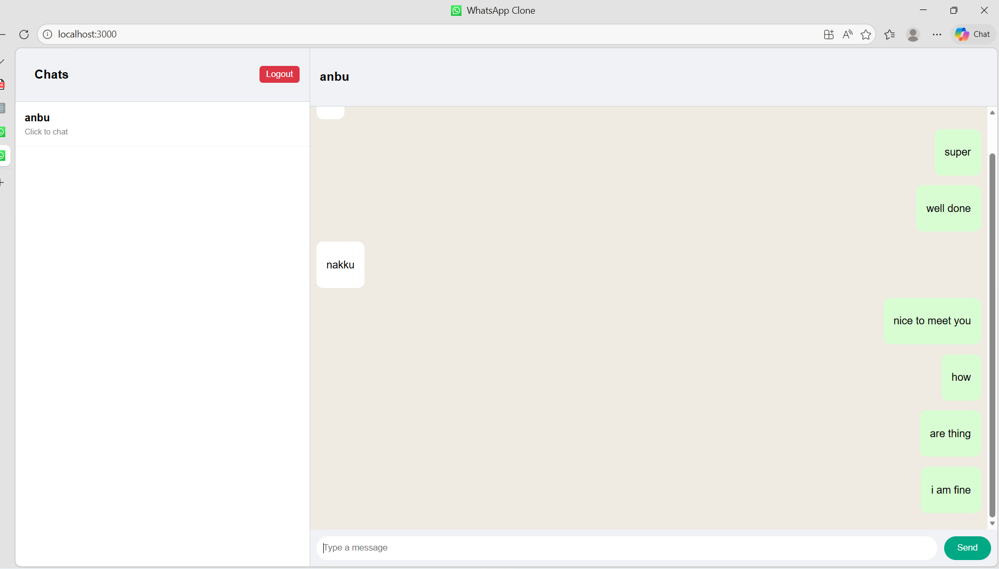
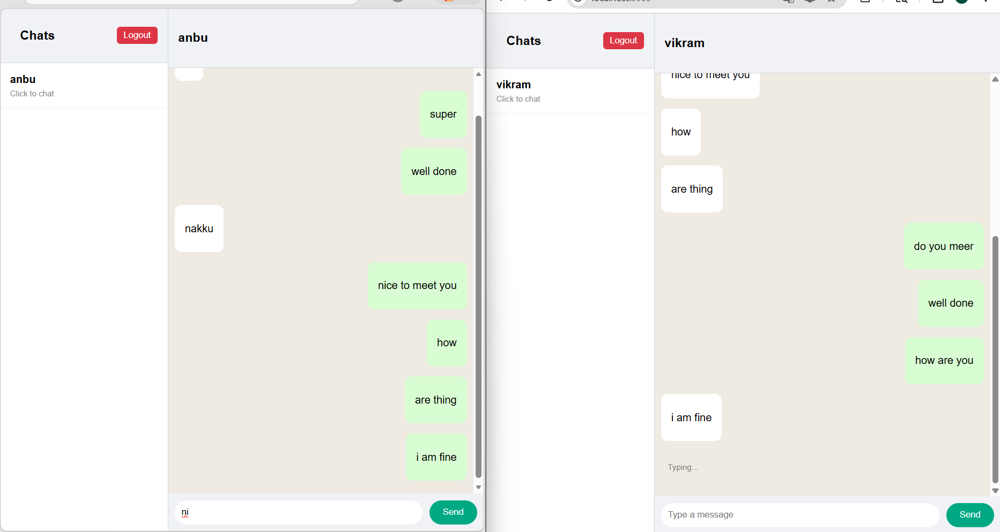

## ⚙️ Setup Instructions

### 1. Clone the repository

```
git clone https://github.com/TamilarasanG17/whatsapp---clone.git
cd whatsapp-clone
```

---

## 🔐 Environment Variables

### Backend

Create a `.env` file inside the `backend` folder:

```
PORT=5000
MONGO_URI=your_mongodb_connection_string
```

---

### Frontend

Create a `.env` file inside the `frontend` folder:

```
REACT_APP_API_URL=http://localhost:5000
```

---

## 🗄️ Database Setup (MongoDB Atlas)

1. Go to https://www.mongodb.com/atlas
2. Create a free cluster
3. Create a database user
4. Click "Connect" → "Drivers"
5. Copy your connection string
6. Replace it in backend `.env`:

```
MONGO_URI=mongodb+srv://<username>:<password>@cluster.mongodb.net/whatsapp
```

---

## ▶️ Run the Application

### Backend

```
cd backend
npm install
npm start
```

---

### Frontend

```
cd frontend
npm install
npm start
```

---

## 🌐 URLs

* Frontend: http://localhost:3000
* Backend: http://localhost:5000

---

## 🧪 Usage

1. Register two users
2. Open app in two tabs
3. Start chatting in real-time

---

## 📸 Screenshots

### 🔐 Login Page


### 💬 Chat Interface


### ✍️ Typing Indicator

